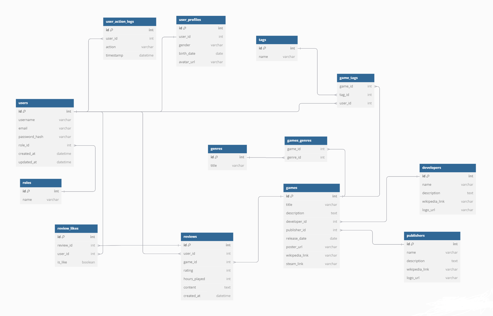

# DB_Games_Reviews

>Лямцев Георгий, 253501

>Тема: Веб-сайт для просмотра отзывов на игры

## Функциональные требования

### Незарегистрированный пользователь
- Поиск и просмотр игр по названию, разработчику, издателю, жанрам, тэгам, рейтингу, времени прохождения.
- Просмотр отзывов, страницы разработчиков и издателей.

### Зарегистрированный пользователь
- Возможности незарегистрированного пользователя.
- Возможность оставлять свои отзывы, ставить лайки, дизлайки на другие.
- Возможность преписывать тэги играм.

### Модератор
- Удаление отзывов, тэгов.
- Управления страницами игр, разработчиков, издателей.

### Админ
- Управление всеми сущностями, в том числе пользователями.

## Сущности

1. **users** - пользователи.
   - **_id_**: int, первичный ключ.
   - **_username_** (_логин_): varchar(50), уникальное, не пустое.
   - **_email_** (_почта_): varchar(100), уникальное, не пустое.
   - **_password_hash_** (_хэш пароля_): char(64), не пустое. 
   - **_role_id_**: int, не пустое, внешний ключ на **roles.id**, связь один-ко-многим.
   - **_created_at_** (_время создания_): datetime.
   - **_updated_at_** (_время обновления_): datetime.
     
2. **userProfiles** - дополнительная информация пользователей.
   - **_id_**: int, первичный ключ.
   - **_user_id_**: int, уникальное, внешний ключ на **users.id**, связь один-к-одному.
   - **_about_** (_о себе_): text.
   - **_birth_date_** (_дата рождения_): date.
   - **_avatar_url_** (_url адрес картинки аватара_): varchar(255).
     
3. **roles** - роль пользователя.
   - **_id_**: int, первичный ключ.
   - **_name_**: varchar(50), уникальное.
     
4. **games** - игры.
   - **_id_**: int, первичный ключ.
   - **_title_** (_название_): varchar(100), не пустое.
   - **_description_** (_описание_): text.
   - **_developer_id_**: int, внешний ключ на **developers.id**, связь один-ко-многим.
   - **_publisher_id_**: int,внешний ключ на **publishers.id**, связь один-ко-многим.
   - **_release_date_** (_дата выхода_): date.
   - **_wikipedia_link_** (_ссылка на страницу в википедии_): varchar(255).
   - **_steam_link_** (_ссылка на страницу в steam_): varchar(255).

   Неявные связи:
    - многие-ко-многим с сущностью **genres** через сущность **games_genres**.
    - многие-ко-многим с сущностью **tags**, принадлежащая **users** через сущность **game_tags**.
       
5. **genres** - жанры.
   - **_id_**: int, первичный ключ.
   - **_title_** (_название_): varchar(30), уникальное, не пустое.
  
   Неявные связи:
    - многие-ко-многим с сущностью **games** через сущность **games_genres**.
       
6. **developers** - разработчики.
   - **_id_**: int, первичный ключ.
   - **_name_** (_название компании_): varchar(50), не пустое.
   - **_description_** (_описание_): text.
   - **_wikipedia_link_** (_ссылка на страничку в википедии_): varchar(255).
   - **_logo_url_** (_url адрес картинки/лого компании_): varchar(255).
     
7. **publishers** - издатели.
   - **_id_**: int, первичный ключ.
   - **_name_** (_название компании_): varchar(50), не пустое.
   - **_description_** (_описание_): text.
   - **_website_link_** (_ссылка на страничку в википеди_и): varchar(255).
   - **_logo_url_** (_url адрес картинки/лого компании_): varchar(255).
     
8. **tags** - тэги.
   - **_id_**: int, первичный ключ.
   - **_name_** (_имя тэга_): varchar(50), не пустое, уникальное.
  
   Неявные связи:
    - многие-ко-многим с сущностью **games**, принадлежащая **users** через сущность **game_tags**.
     
9. **reviews** - отзывы.
    - **_id_**: int, первичный ключ.
    - **_user_id_**: int, внешний ключ на **users.id**, связь один-ко-многим.
    - **_game_id_**: int, внешний ключ на **games.id**, связь один-ко-многим.
    - **_rating_** (_оценка_): int, не пустое.
    - **_hours_played_** (_часов наигранно_): int.
    - **_content_** (_содержание отзыва_): text, не пустое.
    - **_created_at_** (_время создания_): datetime.
      
10. **review_likes** - лайки на отзывы пользователями.
    - **_id_**: int, первичный ключ.
    - **_review_id_**: int, внешний ключ на **reviews.id**, связь один-ко-многим.
    - **_user_id_**: int, внешний ключ на **users.id**, связь один-ко-многим.
    - **_is_like_** (_поставлен ли лайк или дизлайк_): bool, не пустое.
      
11. **user_action_logs** - логи действий пользователя.
    - **_id_**: int, первичный ключ.
    - **_user_id_**: int, внешний ключ на **users.id**.
    - **_action_** (_действие_): varchar(255), не пустое.
    - **_timestamp_** (_время действия_): datetime.

## Сущности для связи

1. **games_genres** - сущность для связи многие-ко-многим игр и жанров.
   - **_game_id_**: int, внешний ключ на **games.id**, связь один-ко-многим.
   - **_genre_id_**: int, внешний ключ на **genres.id**, связь один-ко-многим.
     
2. **game_tags** - сущность для связи игр с тэгами и пользователем, который его оставил
   - **_game_id_**: int, внешний ключ на **games.id**, связь один-ко-многим.
   - **_tag_id_**: int, внешний ключ на **tags.id**, связь один-ко-многим.
   - **_user_id_**: int, внешний ключ на **users.id**, связь один-ко-многим.

## Диаграмма

  
